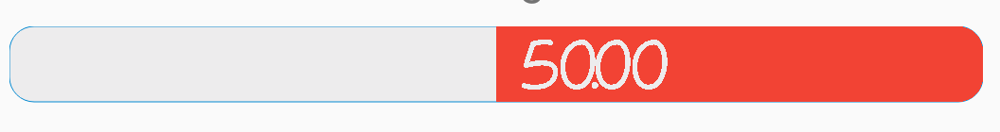
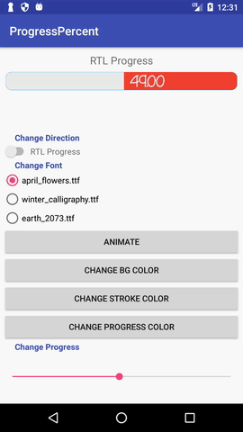
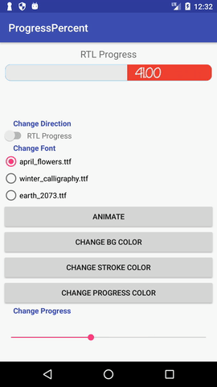
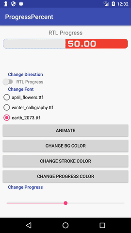

# ProgressPercent
Android Custom progress, with progress written inside.

<p align="center">

</p>

Can change direction (LTR, RTL):
- From XML: use 
```xml
app:direction="rtl"
```
- From code: use
```java
mProgressView.setProgressDirection(View.LAYOUT_DIRECTION_LTR);
mProgressView.setProgressDirection(View.LAYOUT_DIRECTION_RTL);
```

<p align="center">

</p>

To change Font of progress text.
- From XML: use 
```xml
app:textFont="font_winter_calligraphy.ttf"
```
- From code: use
```java
// Font should be added to assets folder before doing this
mProgressView.setProgressFont("font_winter_calligraphy.ttf");
```

<p align="center">

</p>

To change color of (progress, background, stroke).
- From XML: use 
```xml
app:backgroundColor="@color/colorGray"
app:progressColor="@color/result_red"
app:strokeColor="@color/result_blue"
```
- From code: use
```java
mProgressView.setProgressBackgroundColor(getResources().getColor(R.color.colorGray));
mProgressView.setProgressColor(getResources().getColor(R.color.colorGray));
mProgressView.setProgressStrokeColor(getResources().getColor(R.color.colorGray));
```

<p align="center">

</p>

`Inspired by:`
[Rakshak R.Hegde](https://github.com/rakshakhegde/Diffre "Rakshak R.Hegde's Differ Project")
